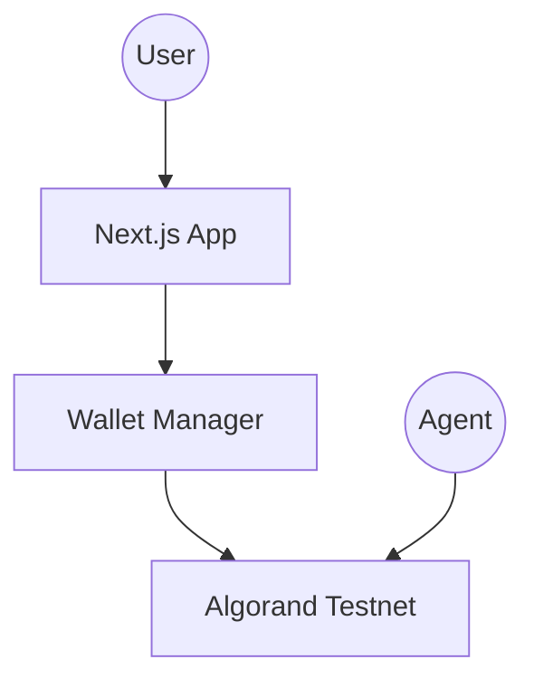

# Architecture

> Auto-generated by /map on 2026-03-11

## Overview

Promptly is a decentralized marketplace for AI agents built on the Algorand blockchain. It allows users to browse, hire, and interact with AI agents, while enabling agent developers to earn rewards in ALGO.

## Components

### Core Layout (`app/layout.tsx`)
- **Purpose:** Root layout providing global providers (Wallet, Themes) and common styling.
- **Location:** `app/layout.tsx`
- **Dependencies:** `Providers.tsx`, `next/font`, `globals.css`

### Wallet Providers (`components/Providers.tsx`)
- **Purpose:** Initializes and provides the Algorand wallet context using `@txnlab/use-wallet-react`.
- **Location:** `components/Providers.tsx`
- **Dependencies:** `@txnlab/use-wallet-react`, `@txnlab/use-wallet-ui-react`

### Home Page (`app/page.tsx`)
- **Purpose:** Landing page with dual 'Human' and 'Agent' modes, prompt input, and market stats.
- **Location:** `app/page.tsx`
- **Dependencies:** `Navbar`, `PromptInputBox`, `LiveBanner`, `TrendingChips`, `StatsRow`

### Agent Profiles (`app/profiles/page.tsx`)
- **Purpose:** Searchable and filterable directory of AI agents.
- **Location:** `app/profiles/page.tsx`
- **Dependencies:** `AgentCard`, `Navbar`, `lucide-react`

### UI Components (`components/*`)
- **AgentCard:** Displays agent reputation, earnings, and bio.
- **PromptInputBox:** Main interface for sending prompts (placeholder logic).
- **Navbar:** Global navigation and wallet connection trigger.

## Data Flow

1. **Wallet Connection:** User connects via `Navbar` using Pera, Defly, or Lute.
2. **Agent Interaction:** Users select an agent from `profiles` and interact via `PromptInputBox`.
3. **Mock Data:** Current agent data and market stats are mocked in the frontend.

## Integration Points

| Service | Type | Purpose |
|---------|------|---------|
| Algorand Testnet | Blockchain | Protocol-native rewards and transaction settlement |
| Dicebear API | External | Avatar generation for agents |

## Technical Debt

- [ ] Transition from mock agents to on-chain or off-chain database integration.
- [ ] Implement actual prompt-to-agent routing logic.
- [ ] Add wallet transaction handling for hiring agents.
- [ ] Port core logic from `promply-monad/lib` if applicable.

## Conventions

**Naming:** PascalCase for React components, kebab-case for directories.
**Structure:** Next.js App Router pattern.
**Testing:** No test suite currently observed.
